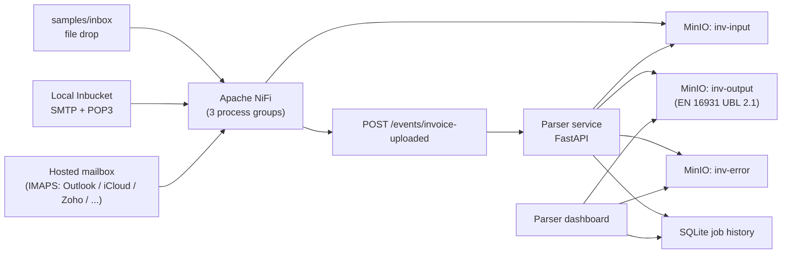
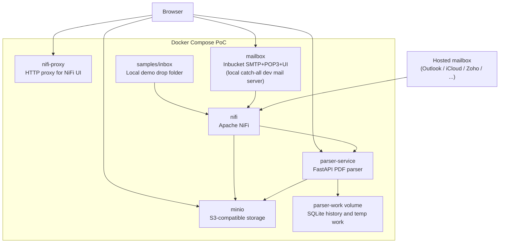
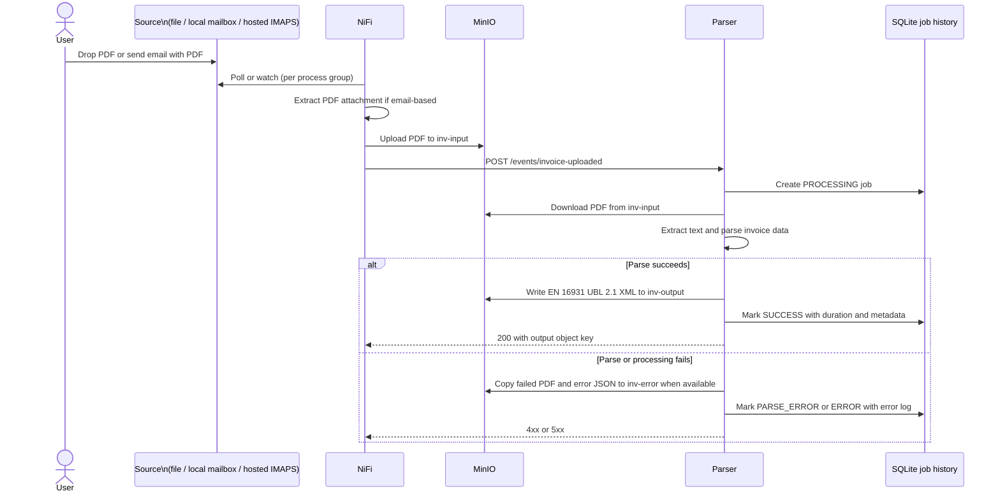
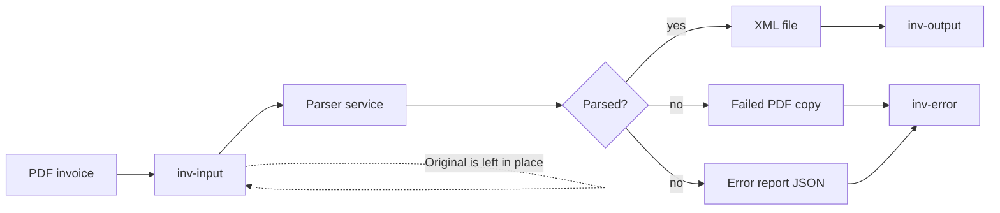
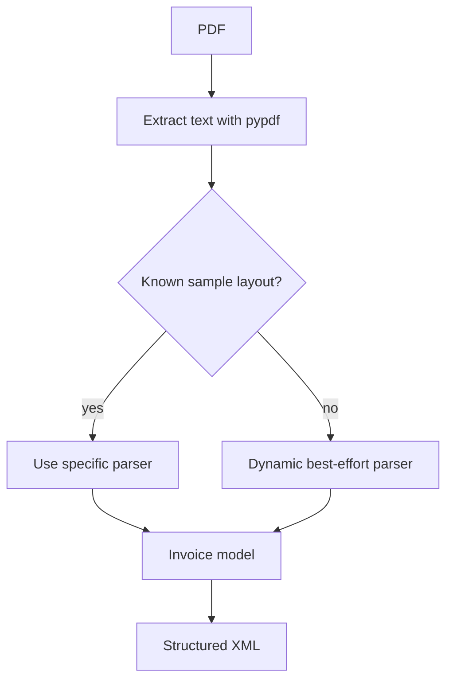
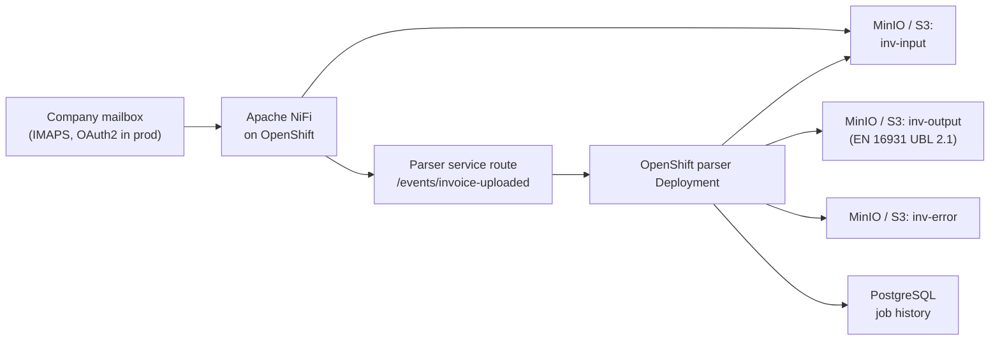

# Architecture

## Overview

This PoC is an event-driven invoice parsing flow. Apache NiFi ingests
PDFs from one of three configurable sources, moves them into object
storage, and notifies the parser. The parser service does not poll
MinIO — it receives an event, downloads the referenced PDF, extracts
invoice data, writes EN 16931-compliant UBL 2.1 XML output, and records
processing history for the dashboard.



The three ingestion sources can coexist — each is a separate NiFi
process group, started or stopped independently. They all converge on
the same parser event contract, so the parser is unaware of which path
a PDF came from.

In the Docker PoC, all services run in one Docker Compose network. In a
later OpenShift deployment, the parser service can become a
containerized OpenShift service, while MinIO or S3-compatible storage
remains the persistence boundary for input and output objects.

## Ingestion Paths

| Path | NiFi process group | Trigger | Created by |
| --- | --- | --- | --- |
| **File drop** | `Invoice PDF Demo` | PDF copied into `samples/inbox/` | `scripts/create_nifi_flow.py` |
| **Local mailbox** | `Invoice Email Demo` | Email arrives in local Inbucket (SMTP/POP3 dev mail server, catch-all) | `scripts/create_nifi_email_flow.py` |
| **Hosted IMAPS** | `Invoice IMAPS Demo` | Email arrives in a hosted mailbox (Outlook / iCloud / Yahoo / Zoho / Fastmail / …) | `scripts/create_nifi_imaps_flow.py` |

Each NiFi flow ends the same way: `PutS3Object -> ReplaceText ->
InvokeHTTP` posting the same event payload. Email-based paths add
`ConsumeIMAP(S) / ConsumePOP3 -> ExtractEmailAttachments ->
RouteOnAttribute (pdf only)` upstream. See
[email-ingestion.md](email-ingestion.md) for the email flow details.

## Component View



Services:

- `nifi`: orchestrates ingestion (file drop, local mailbox, hosted IMAPS) and event calls.
- `nifi-proxy`: local HTTP proxy for the NiFi UI, avoiding browser issues with NiFi's self-signed HTTPS certificate.
- `minio`: S3-compatible object storage for the PoC.
- `mailbox`: Inbucket dev mail server — SMTP listener for sending test mail in, POP3 for NiFi to pull, web UI for browsing. Catch-all (any address works).
- `parser-service`: FastAPI service that downloads PDFs from MinIO, parses them, writes EN 16931 UBL 2.1 XML, and exposes the dashboard.
- `parser-work`: Docker volume used for temporary parser work files and SQLite job history.

Hosted mailboxes (Outlook, iCloud, Zoho, …) are accessed by NiFi over
IMAPS to the public internet; they are not part of the Docker Compose
stack.

## Event Flow

NiFi uploads the PDF first, then sends a lightweight event to the parser. The event contains the bucket and object key rather than the PDF bytes. The same event shape is produced by all three ingestion paths.



Parser event endpoint:

```text
POST /events/invoice-uploaded
```

Example payload:

```json
{
  "bucket": "inv-input",
  "object_key": "example.pdf"
}
```

## Storage Flow



Buckets:

- `inv-input`: original PDF invoices. The input file is left in place even when parsing fails.
- `inv-output`: generated XML files.
- `inv-error`: failed PDF copies and `*.error.json` reports.

## Parser Dashboard

The parser service exposes a lightweight dashboard at:

```text
http://localhost:8000
```

Processing metadata is stored in SQLite under the parser work directory, which is backed by the `parser-work` Docker volume in the PoC.

The dashboard and `/api/jobs` expose:

- input bucket and object key
- started and completed timestamps
- processing duration
- status: `PROCESSING`, `SUCCESS`, `PARSE_ERROR`, or `ERROR`
- invoice number, document type, and line count when parsing succeeds
- output XML link when parsing succeeds
- failed PDF and error report links when error archiving succeeds
- captured error log when parsing fails

Object links are served through parser endpoints that redirect to temporary MinIO presigned URLs:

```text
GET /objects/{job_id}/output
GET /objects/{job_id}/error
GET /objects/{job_id}/error-report
GET /objects/{job_id}/input
```

## Output Format

The parser emits **EN 16931-compliant UBL 2.1 XML** — the European
standard for electronic invoicing. The serializer lives in
`app/serializers/en16931_ubl.py`; the public entry point
`app.xml_writer.invoice_to_xml(invoice)` delegates to it.

Commercial invoices and receipts use the `<Invoice>` root with type
code `380`; credit notes use the `<CreditNote>` root with type code
`381`. Every monetary amount is quantized to 2 decimal places and
carries the `currencyID` attribute. Dates are normalized to ISO 8601.
Tax is broken down per-rate via `cac:TaxSubtotal` elements.

Full mapping (BT/BG codes -> UBL elements), code-list choices, and
limitations of the PoC implementation are documented separately in
[output-format.md](output-format.md).

## Parser Strategy

The parser uses known sample parsers first, then falls back to dynamic best-effort extraction for any readable PDF text with monetary amounts.



Current parser coverage:

- EU VAT invoice
- US invoice
- multipage invoice with many line items
- credit note with negative amounts
- generic invoices with inline labels such as `Invoice number`, `Date of issue`, `Bill to`, and compact `Description Qty Unit price Tax Amount` tables
- generic receipts/tax invoices with colon labels such as receipt number, company/candidate name, item amount, promotion, tax, and transaction amount
- fallback extraction for title-based invoice numbers, bilingual labels, supplier/customer sections, subtotal/tax/total labels, and one synthesized line item when a table cannot be identified
- stacked tables where PDF text extraction emits item, quantity, rate, and amount as separate vertical lines

For production usage, the parser should add supplier-specific templates, OCR fallback for scanned PDFs, confidence scoring, and richer error classification.

## Local Operations

The repo includes wrapper scripts for the Docker Compose stack:

```bash
./scripts/start_services.sh
./scripts/stop_services.sh
```

The start script runs `docker compose up -d --build`, waits for the parser health endpoint, and prints the local URLs and credentials. The stop script runs `docker compose down` and preserves named Docker volumes, including MinIO data, parser history, and NiFi repositories.

## OpenShift Mapping

The PoC components map cleanly to the target deployment:



Suggested production adjustments:

- Run the parser as an OpenShift `Deployment` or `DeploymentConfig`.
- Expose the parser event API internally to NiFi, not publicly unless required.
- Keep MinIO/S3 as the object persistence boundary.
- Move job history from SQLite to PostgreSQL once multiple parser replicas are needed.
- Replace Inbucket / basic-auth IMAPS with the company mail server reached over **OAuth2**-authenticated IMAP (especially for Microsoft 365 / Exchange Online, which has disabled basic-auth IMAP). NiFi's `ConsumeIMAP` supports an OAuth2 token-provider controller service.
- Add deduplication (by `Message-ID` or attachment SHA-256) in NiFi or the parser so forwarded chains don't produce duplicate parses.
- Validate generated XML against the official EN 16931 Schematron rule set, routing non-conformant invoices to `inv-error` with a clear reason.
- Add OCR for scanned PDFs (the current parser relies on pypdf's text extraction).
- Add confidence fields and manual-review workflows for low-confidence extraction.
