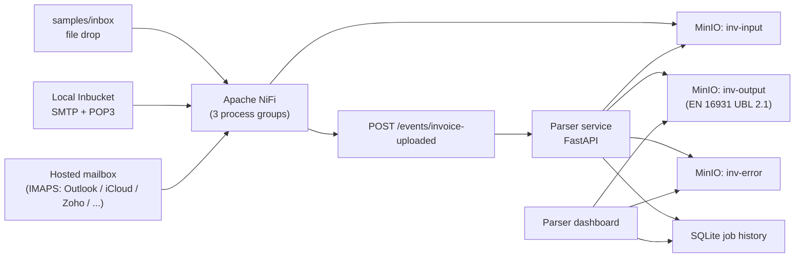
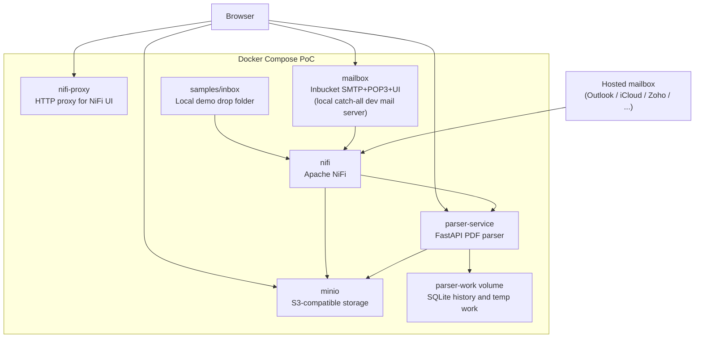
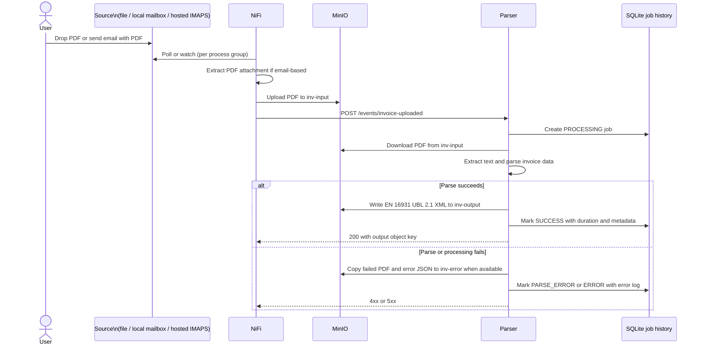
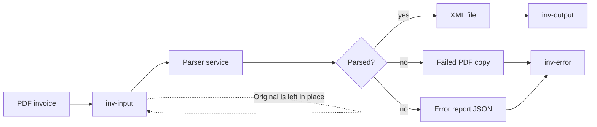
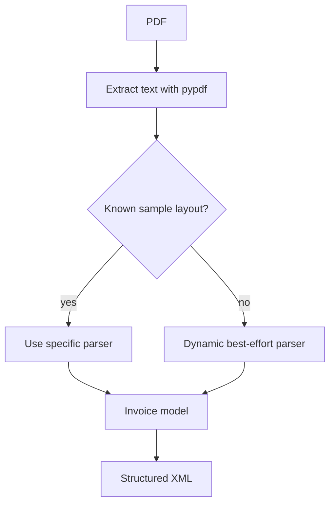
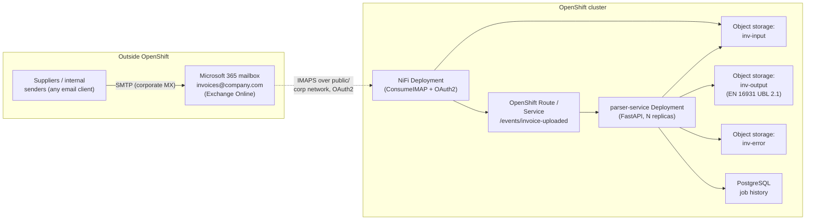

# Architecture

## Overview

This PoC is an event-driven invoice parsing flow. Apache NiFi ingests
PDFs from one of three configurable sources, moves them into object
storage, and notifies the parser. The parser service does not poll
MinIO — it receives an event, downloads the referenced PDF, extracts
invoice data, writes EN 16931-compliant UBL 2.1 XML output, and records
processing history for the dashboard.



The three ingestion sources can coexist — each is a separate NiFi
process group, started or stopped independently. They all converge on
the same parser event contract, so the parser is unaware of which path
a PDF came from.

In the Docker PoC, all services run in one Docker Compose network. In a
later OpenShift deployment, the parser service can become a
containerized OpenShift service, while MinIO or S3-compatible storage
remains the persistence boundary for input and output objects.

## Ingestion Paths

| Path | NiFi process group | Trigger | Created by |
| --- | --- | --- | --- |
| **File drop** | `Invoice PDF Demo` | PDF copied into `samples/inbox/` | `scripts/create_nifi_flow.py` |
| **Local mailbox** | `Invoice Email Demo` | Email arrives in local Inbucket (SMTP/POP3 dev mail server, catch-all) | `scripts/create_nifi_email_flow.py` |
| **Hosted IMAPS** | `Invoice IMAPS Demo` | Email arrives in a hosted mailbox (Outlook / iCloud / Yahoo / Zoho / Fastmail / …) | `scripts/create_nifi_imaps_flow.py` |

Each NiFi flow ends the same way: `PutS3Object -> ReplaceText ->
InvokeHTTP` posting the same event payload. Email-based paths add
`ConsumeIMAP(S) / ConsumePOP3 -> ExtractEmailAttachments ->
RouteOnAttribute (pdf only)` upstream. See
[email-ingestion.md](email-ingestion.md) for the email flow details.

## Component View



Services running inside the Docker Compose stack:

| Container | Image | Host ports | Purpose |
| --- | --- | --- | --- |
| `nifi` | `apache/nifi:2.3.0` | `18443` (HTTPS) | Orchestrates ingestion (file drop, local mailbox, hosted IMAPS) and the parser event call. Holds the three process groups. |
| `nifi-proxy` | `nginx:1.27-alpine` | `18080` (HTTP) | Local HTTP-to-HTTPS proxy in front of NiFi, so the UI is reachable on `http://localhost:18080/nifi` without browser warnings about NiFi's self-signed cert. |
| `minio` | `minio:RELEASE.2025-04-22` | `9000` (S3 API), `9001` (console) | S3-compatible object storage for the three buckets (`inv-input`, `inv-output`, `inv-error`). |
| `minio-init` | `minio/mc` | – (one-shot) | Creates the three buckets at startup, then exits. |
| `mailbox` | `inbucket/inbucket:3.0.4` | `2500` (SMTP), `1100` (POP3), `9090` (web UI) | Local catch-all dev mail server — accepts any inbound SMTP, exposes POP3 for NiFi, browseable web UI. Used by the file-drop and local-email demo paths. |
| `parser-service` | (built from `parser-service/`) | `8000` (API + dashboard) | FastAPI service that consumes invoice events, downloads PDFs from MinIO, parses them, writes EN 16931 UBL 2.1 XML, and exposes `/api/jobs` + dashboard. |

Docker volumes:

| Volume | Mounted in | Holds |
| --- | --- | --- |
| `minio-data` | `minio` | Object storage (the three buckets) |
| `parser-work` | `parser-service` | SQLite job history + transient parser working files |
| `nifi-database`, `nifi-flowfile`, `nifi-content`, `nifi-provenance`, `nifi-state` | `nifi` | NiFi internal repositories; persist flow definitions and queued data across restarts |

External (not in the Compose stack):

- **Hosted mailboxes** (Outlook.com, iCloud, Yahoo, Zoho, Fastmail …)
  reached by NiFi over the public internet via IMAPS. In the target
  OpenShift deployment this becomes the **company's M365 / Exchange
  Online mailbox** — see *Deployment Target: OpenShift* below.

### Component disposition: dev-only vs. production-shaped

Not every container in the PoC is meant to ship to OpenShift. The
table below makes the intent explicit so the production move doesn't
accidentally drag dev-only services with it.

| Component | Disposition | Notes |
| --- | --- | --- |
| `parser-service` | **Ships to OpenShift** as-is | FastAPI app, stateless apart from the SQLite history (which moves to PostgreSQL in prod) |
| `nifi` | **Ships to OpenShift** as-is | Single-node NiFi 2.x; could be replaced by a managed NiFi or scaled cluster later |
| `minio` | **Ships to OpenShift** *or* replaced by AWS S3 / Azure Blob | The PoC uses MinIO for the S3 surface; ODF / cloud object storage are drop-in |
| `nifi-proxy` | **Replaced** | OpenShift Routes / Ingress with proper TLS certs make the nginx hop unnecessary |
| `mailbox` (Inbucket) | **Dropped** in prod | Dev catch-all only. Replaced by the company's real mailbox accessed via IMAPS (see ingestion table below). |
| `minio-init` | **Replaced** | A one-shot Job / Helm hook creates buckets on first deploy |
| `samples/inbox` (file drop) | **Dropped** in prod | Local demo affordance; production uses the email path |
| `send_test_email.py` script | **Dev tooling only** | Used for offline / no-internet demos; never shipped |
| `parser-work` volume (SQLite) | **Replaced** by PostgreSQL | Single-replica SQLite does not survive multi-replica scaling |

## Event Flow

NiFi uploads the PDF first, then sends a lightweight event to the parser. The event contains the bucket and object key rather than the PDF bytes. The same event shape is produced by all three ingestion paths.



Parser event endpoint:

```text
POST /events/invoice-uploaded
```

Example payload:

```json
{
  "bucket": "inv-input",
  "object_key": "example.pdf"
}
```

## Storage Flow



Buckets:

- `inv-input`: original PDF invoices. The input file is left in place even when parsing fails.
- `inv-output`: generated XML files.
- `inv-error`: failed PDF copies and `*.error.json` reports.

## Parser Dashboard

The parser service exposes a lightweight dashboard at:

```text
http://localhost:8000
```

Processing metadata is stored in SQLite under the parser work directory, which is backed by the `parser-work` Docker volume in the PoC.

The dashboard and `/api/jobs` expose:

- input bucket and object key
- started and completed timestamps
- processing duration
- status: `PROCESSING`, `SUCCESS`, `PARSE_ERROR`, or `ERROR`
- invoice number, document type, and line count when parsing succeeds
- output XML link when parsing succeeds
- failed PDF and error report links when error archiving succeeds
- captured error log when parsing fails

Object links are served through parser endpoints that redirect to temporary MinIO presigned URLs:

```text
GET /objects/{job_id}/output
GET /objects/{job_id}/error
GET /objects/{job_id}/error-report
GET /objects/{job_id}/input
```

## Output Format

The parser emits **EN 16931-compliant UBL 2.1 XML** — the European
standard for electronic invoicing. The serializer lives in
`app/serializers/en16931_ubl.py`; the public entry point
`app.xml_writer.invoice_to_xml(invoice)` delegates to it.

Commercial invoices and receipts use the `<Invoice>` root with type
code `380`; credit notes use the `<CreditNote>` root with type code
`381`. Every monetary amount is quantized to 2 decimal places and
carries the `currencyID` attribute. Dates are normalized to ISO 8601.
Tax is broken down per-rate via `cac:TaxSubtotal` elements.

Full mapping (BT/BG codes -> UBL elements), code-list choices, and
limitations of the PoC implementation are documented separately in
[output-format.md](output-format.md).

## Parser Strategy

The parser uses known sample parsers first, then falls back to dynamic best-effort extraction for any readable PDF text with monetary amounts.



Current parser coverage:

- EU VAT invoice
- US invoice
- multipage invoice with many line items
- credit note with negative amounts
- generic invoices with inline labels such as `Invoice number`, `Date of issue`, `Bill to`, and compact `Description Qty Unit price Tax Amount` tables
- generic receipts/tax invoices with colon labels such as receipt number, company/candidate name, item amount, promotion, tax, and transaction amount
- fallback extraction for title-based invoice numbers, bilingual labels, supplier/customer sections, subtotal/tax/total labels, and one synthesized line item when a table cannot be identified
- stacked tables where PDF text extraction emits item, quantity, rate, and amount as separate vertical lines

For production usage, the parser should add supplier-specific templates, OCR fallback for scanned PDFs, confidence scoring, and richer error classification.

## Local Operations

The repo includes wrapper scripts for the Docker Compose stack:

```bash
./scripts/start_services.sh
./scripts/stop_services.sh
```

The start script runs `docker compose up -d --build`, waits for the parser health endpoint, and prints the local URLs and credentials. The stop script runs `docker compose down` and preserves named Docker volumes, including MinIO data, parser history, and NiFi repositories.

## Deployment Target: OpenShift

The ultimate target is to run the full pipeline on OpenShift, consuming
invoices from the company's internal **Microsoft 365 / Exchange Online
mailbox**. The corporate mailbox is the only major component that
stays *outside* the cluster — everything else moves in.



### What moves to OpenShift and how

| Component (PoC) | Target on OpenShift | Migration notes |
| --- | --- | --- |
| `parser-service` | `Deployment` + `Service` + `Route` | Run N replicas behind the Service. Stateless once SQLite is replaced. |
| `nifi` | `StatefulSet` (single instance for PoC; cluster later) | NiFi repositories on a `PersistentVolumeClaim`. Sensitive properties decrypted using a `Secret` containing the NiFi key. |
| `minio` | Either **MinIO Operator on OpenShift** *or* **AWS S3 / Azure Blob via the same S3 API** | Parser only knows the S3 surface, so the swap is configuration-only (`MINIO_ENDPOINT`, credentials). |
| `parser-work` (SQLite) | **PostgreSQL** (CrunchyData / managed RDS) | SQLite is single-replica only. Schema is trivial — three tables. Connection string injected via env. |
| Buckets | Provisioned by a `Job` / Helm hook | Same names: `inv-input`, `inv-output`, `inv-error`. |
| Inbucket (`mailbox`) | **Removed** | Replaced by the M365 mailbox. No equivalent ships to prod. |
| `samples/inbox` file drop | **Removed** | Email is the only ingestion path in prod. |
| `nifi-proxy` | **Removed** | OpenShift Route handles TLS termination directly. |
| Dev scripts (`send_test_email.py`, `create_nifi_*_flow.py`) | Stay in the repo as **CI / one-shot tooling** | Flow-creation scripts can be invoked from a post-deploy `Job` to provision the NiFi process group on a fresh NiFi instance. |

### The mail side (M365 / Exchange Online specifics)

Microsoft has **disabled basic-auth IMAP** on personal Outlook.com
accounts and on virtually all M365 / Exchange Online tenants. Plain
`IMAPS_USER` + `IMAPS_PASSWORD` (which is what the PoC's hosted IMAPS
flow uses) **will not work** against the company mailbox.

The production setup requires:

1. **Azure AD / Microsoft Entra app registration** with the
   `IMAP.AccessAsUser.All` delegated permission (or
   `Mail.Read` application permission for a service-account flow).
2. A **client ID + client secret** (and tenant ID), stored in OpenShift
   `Secret`s.
3. NiFi's `ConsumeIMAP` configured with
   `authorization-mode = oauth2-based-authorization-mode` plus a
   `StandardOauth2AccessTokenProvider` controller service that mints
   tokens against
   `https://login.microsoftonline.com/{tenant}/oauth2/v2.0/token`
   with scope `https://outlook.office365.com/.default`.
4. The mailbox itself (`invoices@company.com` or similar) must have
   IMAP enabled at the tenant level — `Set-CASMailbox` PowerShell or
   the M365 admin portal.

The shape of the NiFi flow stays identical — `ConsumeIMAP →
ExtractEmailAttachments → RouteOnAttribute → PutS3Object → ReplaceText
→ InvokeHTTP` — only the authentication block on the source processor
changes. The same is true for the OpenShift parser; it sees an event,
not an email.

### Additional production hardening

- **Internal-only parser API.** Expose the parser `Route` only inside
  the cluster (no `host:` for external traffic) — the only legitimate
  client is NiFi.
- **Schematron validation.** Add a post-serialization step that
  validates each output document against the official EN 16931
  Schematron rule set; route failures to `inv-error` with a structured
  reason. See [output-format.md](output-format.md) for the known
  semantic-conformance gaps.
- **Deduplication.** A forwarded invoice can arrive twice. Dedupe by
  `Message-ID` or by SHA-256 of the attachment in either NiFi
  (`DetectDuplicate` processor) or in the parser before writing to
  `inv-input`.
- **OCR fallback.** The current parser relies on `pypdf` text
  extraction. Scanned-image PDFs return empty text. Add an OCR pass
  (Tesseract or a cloud OCR API) when extracted text is too short.
- **Confidence + manual review.** For low-confidence extractions
  (e.g. dynamic-parser fallback used, totals don't balance, key
  fields blank), emit the XML to a separate `inv-review` bucket and
  surface it in the dashboard with a "needs review" status.
- **Secret management.** All credentials — MinIO/S3, Postgres, NiFi
  sensitive-property key, Azure AD client secret — live in OpenShift
  `Secret`s. Nothing in env files or the repo.
