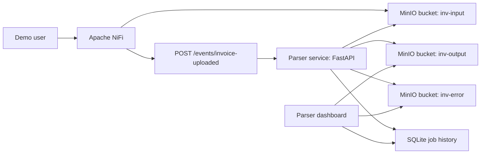
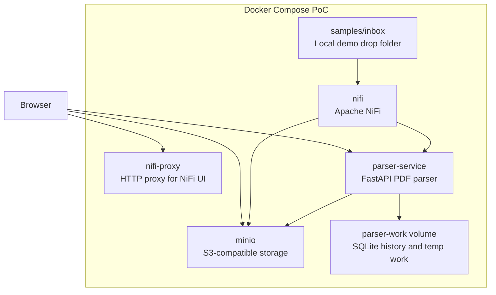
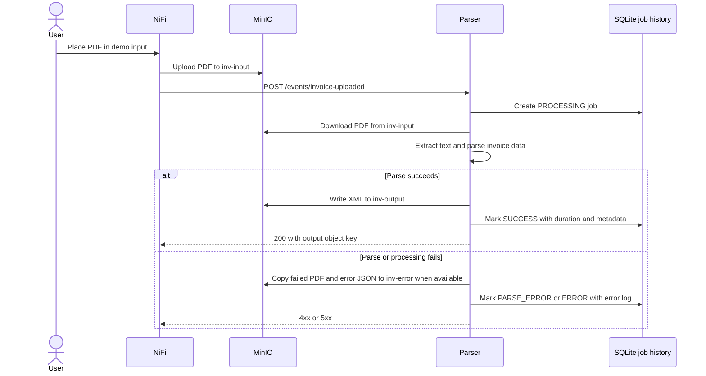
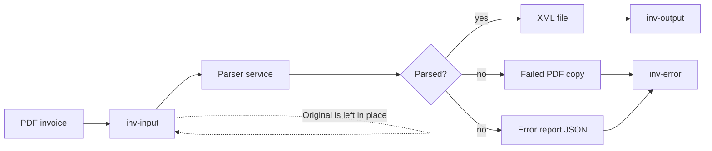
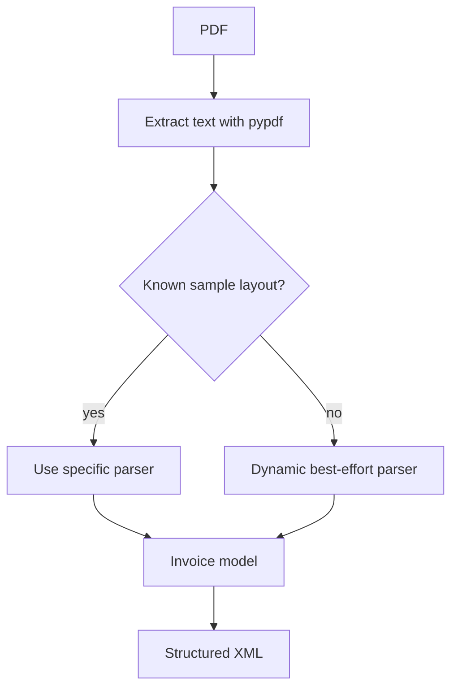
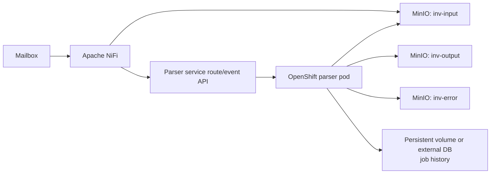

# Architecture

## Overview

This PoC is an event-driven invoice parsing flow. Apache NiFi is responsible for moving PDF files into object storage and notifying the parser. The parser service does not poll MinIO. It receives an event, downloads the referenced PDF, extracts invoice data, writes XML output, and records processing history for the dashboard.



In the Docker PoC, all services run in one Docker Compose network. In a later OpenShift deployment, the parser service can become a containerized OpenShift service, while MinIO or S3-compatible storage remains the persistence boundary for input and output objects.

## Component View



Services:

- `nifi`: receives demo files and orchestrates file transfer plus event call.
- `nifi-proxy`: local HTTP proxy for the NiFi UI, avoiding browser issues with NiFi's self-signed HTTPS certificate.
- `minio`: S3-compatible object storage for the PoC.
- `parser-service`: FastAPI service that downloads PDFs from MinIO, parses them, writes XML, and exposes the dashboard.
- `parser-work`: Docker volume used for temporary parser work files and SQLite job history.

## Event Flow

NiFi uploads the PDF first, then sends a lightweight event to the parser. The event contains the bucket and object key rather than the PDF bytes.



Parser event endpoint:

```text
POST /events/invoice-uploaded
```

Example payload:

```json
{
  "bucket": "inv-input",
  "object_key": "example.pdf"
}
```

## Storage Flow



Buckets:

- `inv-input`: original PDF invoices. The input file is left in place even when parsing fails.
- `inv-output`: generated XML files.
- `inv-error`: failed PDF copies and `*.error.json` reports.

## Parser Dashboard

The parser service exposes a lightweight dashboard at:

```text
http://localhost:8000
```

Processing metadata is stored in SQLite under the parser work directory, which is backed by the `parser-work` Docker volume in the PoC.

The dashboard and `/api/jobs` expose:

- input bucket and object key
- started and completed timestamps
- processing duration
- status: `PROCESSING`, `SUCCESS`, `PARSE_ERROR`, or `ERROR`
- invoice number, document type, and line count when parsing succeeds
- output XML link when parsing succeeds
- failed PDF and error report links when error archiving succeeds
- captured error log when parsing fails

Object links are served through parser endpoints that redirect to temporary MinIO presigned URLs:

```text
GET /objects/{job_id}/output
GET /objects/{job_id}/error
GET /objects/{job_id}/error-report
GET /objects/{job_id}/input
```

## Parser Strategy

The parser uses known sample parsers first, then falls back to dynamic best-effort extraction for any readable PDF text with monetary amounts.



Current parser coverage:

- EU VAT invoice
- US invoice
- multipage invoice with many line items
- credit note with negative amounts
- generic invoices with inline labels such as `Invoice number`, `Date of issue`, `Bill to`, and compact `Description Qty Unit price Tax Amount` tables
- generic receipts/tax invoices with colon labels such as receipt number, company/candidate name, item amount, promotion, tax, and transaction amount
- fallback extraction for title-based invoice numbers, bilingual labels, supplier/customer sections, subtotal/tax/total labels, and one synthesized line item when a table cannot be identified
- stacked tables where PDF text extraction emits item, quantity, rate, and amount as separate vertical lines

For production usage, the parser should add supplier-specific templates, OCR fallback for scanned PDFs, confidence scoring, and richer error classification.

## Local Operations

The repo includes wrapper scripts for the Docker Compose stack:

```bash
./scripts/start_services.sh
./scripts/stop_services.sh
```

The start script runs `docker compose up -d --build`, waits for the parser health endpoint, and prints the local URLs and credentials. The stop script runs `docker compose down` and preserves named Docker volumes, including MinIO data, parser history, and NiFi repositories.

## OpenShift Mapping

The PoC components map cleanly to the target deployment:



Suggested production adjustments:

- Run the parser as an OpenShift `Deployment` or `DeploymentConfig`.
- Expose the parser event API internally to NiFi, not publicly unless required.
- Keep MinIO/S3 as the object persistence boundary.
- Move job history from SQLite to PostgreSQL if multiple parser replicas are needed.
- Add OCR for scanned PDFs.
- Add confidence fields and manual review workflows for low-confidence extraction.
