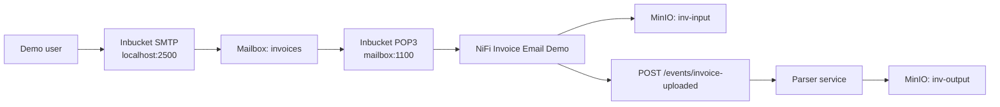
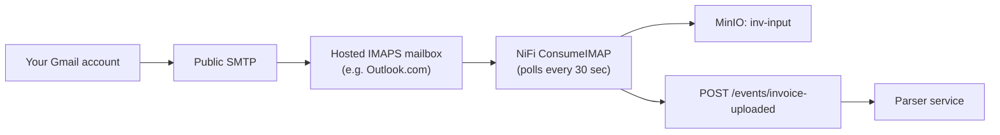

# Email Ingestion

The PoC stack includes an optional **email ingestion path** so the full
"invoice arrives by email -> parser -> XML" flow can be demoed locally
without depending on a real mail provider. A lightweight catch-all dev
mail server (Inbucket) accepts SMTP in and serves POP3 out; NiFi polls
the POP3 mailbox, extracts PDF attachments, and feeds them into the same
parser-event endpoint the file-based flow uses.

## Why a Local Mailbox

Gmail (and any other public mail provider) delivers mail by resolving
your domain's MX record on public DNS and connecting to that server on
port 25. A container running on a laptop is not publicly reachable, and
most residential ISPs block inbound port 25. There is no clean way to
have Gmail deliver directly to a local Docker container.

The PoC handles this by:

- Running **Inbucket** locally as a catch-all SMTP + POP3 + Web UI server.
- Sending test emails directly to the local SMTP server with
  `scripts/send_test_email.py`.

If real internet-to-local delivery is ever required, the recommended
path is to add a Cloudflare Tunnel or an inbound email forwarding
service (ImprovMX, ForwardEmail.net) in front of Inbucket. That is out
of scope for the PoC.

## Components

| Service | URL / port | Purpose |
| --- | --- | --- |
| Mailbox Web UI | http://localhost:9090 | Browse received mail per mailbox |
| Mailbox SMTP | `localhost:2500` | Send mail in |
| Mailbox POP3 | `localhost:1100` | NiFi `ConsumePOP3` polls this |

Inbucket is a **catch-all** server. Any address is accepted; mail
addressed to `<local-part>@<anything>` lands in a mailbox named after
the `<local-part>`. The PoC standardizes on `invoices@inbucket.local`,
so all mail accumulates in the `invoices` mailbox.

POP3 access in Inbucket accepts **any password** for any mailbox name,
so no credentials need to be provisioned.

## End-to-End Flow



## NiFi Process Group

The script `scripts/create_nifi_email_flow.py` creates the
`Invoice Email Demo` process group. All processors are created
**disabled** so the flow can be reviewed before it runs.

```mermaid
flowchart LR
  pop3["ConsumePOP3\nPoll mailbox (POP3)"]
  extract["ExtractEmailAttachments"]
  route["RouteOnAttribute\nKeep PDF attachments only"]
  attr["UpdateAttribute\nSet object key from email"]
  put["PutS3Object\nPut email PDF to inv-input"]
  replace["ReplaceText\nBuild parser event JSON"]
  invoke["InvokeHTTP\nCall parser service"]

  pop3 -- "success" --> extract
  extract -- "attachments" --> route
  route -- "pdf" --> attr
  attr -- "success" --> put
  put -- "success" --> replace
  replace -- "success" --> invoke
```



Processor configuration:

| Processor | Key properties |
| --- | --- |
| `ConsumePOP3` | host `mailbox`, port `1100`, user `invoices`, password `any`, folder `INBOX`, run schedule `30 sec` |
| `ExtractEmailAttachments` | emits one flowfile per attachment; `original` + `failure` auto-terminated |
| `RouteOnAttribute` | `pdf = ${filename:toLower():endsWith('.pdf')}`; `unmatched` auto-terminated |
| `UpdateAttribute` | `s3.object.key = ${now():format('yyyyMMdd-HHmmss')}-${filename}` to avoid collisions |
| `PutS3Object` | bucket `inv-input`, endpoint `http://minio:9000`, path-style, MinIO credentials controller service |
| `ReplaceText` | replacement value `{"bucket":"inv-input","object_key":"${s3.object.key}"}` |
| `InvokeHTTP` | POST `http://parser-service:8000/events/invoice-uploaded` |

The MinIO credentials controller service from the file-based flow is
reused — the script will create it if it does not already exist in the
process group.

## Quick Start

1. Bring the stack up (mailbox is part of `docker-compose.yml`):

   ```bash
   ./scripts/start_services.sh
   ```

2. Create the NiFi email-ingestion flow once NiFi has booted
   (~2 minutes on first run):

   ```bash
   python3 scripts/create_nifi_email_flow.py
   ```

3. In the NiFi UI, open the `Invoice Email Demo` process group and
   start the processors. They are disabled by default so you can review
   them first.

4. Send a test email with a PDF attachment:

   ```bash
   python3 scripts/send_test_email.py path/to/invoice.pdf
   # Defaults: To=invoices@inbucket.local, host=localhost:2500
   ```

5. Watch the result land:

   - Mailbox UI: <http://localhost:9090/m/invoices>
   - MinIO `inv-input` and `inv-output`: <http://localhost:9001>
   - Parser dashboard: <http://localhost:8000>

## Sending Mail Manually

The `send_test_email.py` script is a small wrapper around `smtplib`. The
same effect can be reproduced from any SMTP client (Thunderbird, swaks,
`msmtp`, etc.) pointed at `localhost:2500` with no auth and no TLS. Any
recipient address whose local-part is `invoices` will be picked up by
the NiFi POP3 processor; for example all of these route to the same
mailbox:

- `invoices@inbucket.local`
- `invoices@example.com`
- `invoices@anything.tld`

## Failure Modes

| Symptom | Likely cause |
| --- | --- |
| Email never appears in `inv-input` | NiFi processors not started, or POP3 schedule has not fired yet (30s) |
| Email arrives but no XML appears | PDF attachment failed to parse — check parser dashboard for the error log and `inv-error/failed/` |
| Attachment is dropped | `RouteOnAttribute` keeps only `.pdf` files; non-PDF attachments are auto-terminated by design |
| Duplicate filenames cause overwrites | `UpdateAttribute` prepends a timestamp; if a sender resends the exact same filename within a second, collisions are possible — the parser job history still records both runs |

## Hosted IMAPS Ingestion (Outlook, iCloud, etc.)

The local Inbucket path is great for offline demos, but for an
end-to-end test that includes a real internet hop ("send from Gmail and
watch the parser pick it up"), point NiFi at a hosted IMAPS mailbox you
control. Any provider with IMAPS access works: Outlook.com, iCloud
Mail, Yahoo Mail, Zoho Mail, Fastmail, Mailbox.org, and so on.

### Architecture



### Recommended provider

**Outlook.com** is the lowest-friction option: free, no desktop bridge
required, supports app passwords. Sign up at outlook.com, enable IMAP
in Settings -> Mail -> Sync email -> POP and IMAP, then generate an
**app password** from your Microsoft account security page if you have
2FA enabled.

### Setup

1. Export credentials locally (never commit these):

   ```bash
   export IMAPS_USER='invoice-parser-poc@outlook.com'
   export IMAPS_PASSWORD='your-app-password'

   # Optional overrides:
   export IMAPS_HOST='outlook.office365.com'  # default
   export IMAPS_PORT='993'                    # default
   export IMAPS_FOLDER='INBOX'                # default
   export IMAPS_SCHEDULE='30 sec'             # default
   export IMAPS_DELETE='false'                # default; true to delete after fetch
   ```

2. Create the NiFi process group:

   ```bash
   python3 scripts/create_nifi_imaps_flow.py
   ```

   This creates `Invoice IMAPS Demo` with all processors disabled. The
   password is pushed into NiFi as a **sensitive property**, so it is
   encrypted at rest and redacted in the UI and provenance.

3. In the NiFi UI, open the process group and start the processors.

4. Send an email **from your real Gmail** to the Outlook address with a
   PDF attached. Within ~30 seconds the parser dashboard at
   <http://localhost:8000> should show a new job.

### Provider IMAPS settings

| Provider | `IMAPS_HOST` | `IMAPS_PORT` | Auth notes |
| --- | --- | --- | --- |
| Outlook.com / Hotmail | `outlook.office365.com` | `993` | App password if 2FA is on |
| iCloud Mail | `imap.mail.me.com` | `993` | Always requires an app-specific password |
| Yahoo Mail | `imap.mail.yahoo.com` | `993` | App password required |
| Zoho Mail | `imap.zoho.com` | `993` | Enable IMAP in Zoho settings first |
| Fastmail | `imap.fastmail.com` | `993` | App password recommended |
| Mailbox.org | `imap.mailbox.org` | `993` | Standard credentials |

### Why NiFi directly (and not a separate poller container)

NiFi's `ConsumeIMAP` processor already does what a custom mail-poller
container would do — fetch, retry, error-route, schedule. Adding a
separate container would duplicate that functionality, store
credentials in two places, and create another moving part to monitor.
The only reasons to introduce a separate client would be transformations
NiFi cannot express, or credential segregation away from NiFi entirely
— neither applies here.

### Rotating the IMAPS Password

App passwords should be rotated on a schedule and **immediately** if one
has leaked (chat, screenshot, error log, screen share, ...). Rotation is
a two-sided operation: revoke and re-issue at the mail provider, then
push the new value into NiFi.

#### Step 1 — Mail provider side (manual)

| Provider | Where to revoke + re-issue |
| --- | --- |
| Outlook.com / Hotmail | <https://account.microsoft.com/security> -> Advanced security options -> App passwords -> remove old, generate new |
| iCloud Mail | <https://account.apple.com> -> Sign-In and Security -> App-Specific Passwords -> revoke + create new |
| Yahoo Mail | <https://login.yahoo.com/account/security> -> Generate and manage app passwords |
| Zoho Mail | Mail Settings -> Mail Accounts -> Security -> Application-Specific Passwords |
| Fastmail | <https://app.fastmail.com/settings/security/devices> -> revoke + new app password |

Revoke the old credential **before** generating the new one. Any device
or process still using the old password starts failing immediately,
which is the desired behaviour after a leak.

If the leaked credential was your **account password** (not an app
password), change the account password first, then re-issue all app
passwords; the latter become invalid when the parent account password
changes on most providers.

#### Step 2 — NiFi side (scripted)

The rotation script updates only the `password` property on the
`ConsumeIMAP` processor in the `Invoice IMAPS Demo` process group. It
stops the processor (NiFi forbids editing a RUNNING processor), pushes
the new value, and optionally restarts.

Three ways to supply the new password, in order of safety:

1. **From a file** (recommended — never lands in env or shell history):

   ```bash
   # Read from your password manager, then shred the temp file.
   op read 'op://Personal/Outlook PoC/app password' > /tmp/pw && \
     python3 scripts/rotate_imaps_password.py --password-file /tmp/pw --start && \
     shred -u /tmp/pw
   ```

2. **From an env var** (acceptable for one-off rotations):

   ```bash
   read -rs IMAPS_PASSWORD_NEW   # silent prompt; not in history if shell is configured
   export IMAPS_PASSWORD_NEW
   python3 scripts/rotate_imaps_password.py --start
   unset IMAPS_PASSWORD_NEW
   ```

3. **Interactive prompt** (no flag at all):

   ```bash
   python3 scripts/rotate_imaps_password.py --start
   # New IMAPS app password: ********
   # Confirm new password:  ********
   ```

   The prompt uses `getpass`, so terminal echo is suppressed and the
   value never appears in shell history.

#### Step 3 — Verify

```bash
python3 scripts/diagnose_imaps_flow.py
```

You should see:

- `Poll mailbox (IMAPS)` state `RUNNING` (or `STOPPED` if you did not
  pass `--start`)
- `validationStatus = VALID`
- No new `AUTHENTICATE failed` bulletins after one poll cycle (~30s)

If `AUTHENTICATE failed` reappears, the password is wrong, expired, or
the mail provider has disabled basic auth on the account. Re-run
through step 1.

#### Things this script intentionally does **not** do

- It does not touch `IMAPS_PASSWORD` in your shell or any `.env` file.
  The script is for NiFi state only; your local secret store is a
  separate concern.
- It does not write the new password to disk in the repo. NiFi encrypts
  the sensitive property server-side; the value never lands in git.
- It does not auto-restart on failure. If the processor refuses to
  start (validation invalid, network down, ...), it stays STOPPED so
  the next poll cycle does not hammer the mail server with bad creds.

### Coexisting ingestion paths

After running all three flow-creation scripts, NiFi will have three
process groups, each producing the same parser event payload:

| Process group | Trigger | Created by |
| --- | --- | --- |
| `Invoice PDF Demo` | New file in `samples/inbox/` | `scripts/create_nifi_flow.py` |
| `Invoice Email Demo` | New mail in local Inbucket | `scripts/create_nifi_email_flow.py` |
| `Invoice IMAPS Demo` | New mail in hosted Outlook/iCloud/etc. | `scripts/create_nifi_imaps_flow.py` |

Toggle between scenarios by starting/stopping the corresponding process
group; they do not interfere with each other.

## Production Notes

For an OpenShift deployment that needs real email ingestion:

- Replace Inbucket with a managed inbox or company mail server. NiFi's
  `ConsumeIMAP` is preferred over `ConsumePOP3` since it supports
  folders and idempotent reads.
- Add SPF/DKIM/DMARC validation and quarantining at the mail layer
  before NiFi sees the messages.
- Add deduplication (by `Message-ID` or attachment SHA-256) in NiFi or
  in the parser, so a forwarded chain does not produce duplicate parses.
- Consider sender allow-listing and attachment-size limits in the mail
  server, not in NiFi, to fail fast.
